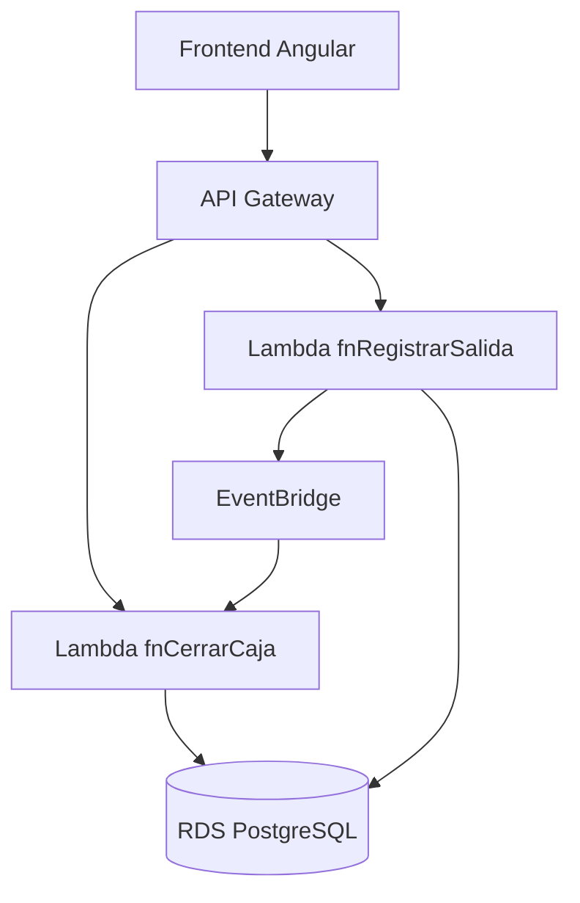
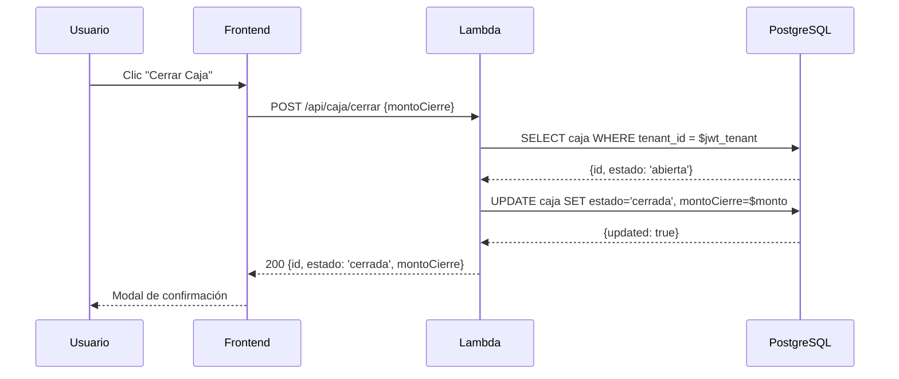
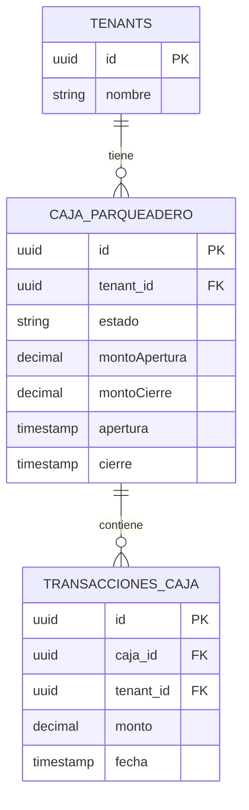
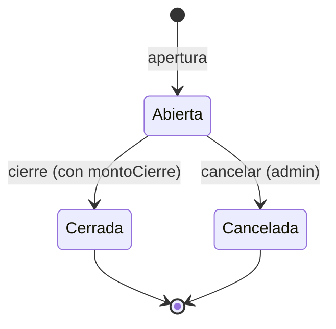

# /gd:diagram — Generar Diagramas desde Código o Diseño

## Propósito
Generar diagramas automáticamente en formato Mermaid desde el código existente, el plan técnico o la especificación. Produce visualizaciones de arquitectura, flujos de datos, secuencias y modelos de BD listos para incluir en documentación.

---

## Tipos de Diagrama Disponibles

### 1. Arquitectura de Componentes (`architecture`)
Muestra los servicios, módulos y sus relaciones.



### 2. Flujo de Secuencia (`sequence`)
Muestra el intercambio de mensajes entre actores.



### 3. Modelo de Datos / ER (`erd`)
Muestra entidades y relaciones de la BD.



### 4. Flujo del Pipeline SDD (`pipeline`)
Muestra el estado actual del ciclo SDD del change activo.

```mermaid
flowchart LR
    S([specify]) -->|APPROVED| C([clarify])
    C -->|PASS| P([plan])
    P -->|Done| B([breakdown])
    B -->|Tasks creadas| I([implement])
    I -->|All tasks done| R([review])
    R -->|PASS| V([verify])
    V -->|VERIFY PASS| A([archive])

    style S fill:#22c55e
    style C fill:#22c55e
    style P fill:#22c55e
    style B fill:#22c55e
    style I fill:#f59e0b
    style R fill:#e5e7eb
    style V fill:#e5e7eb
    style A fill:#e5e7eb
```



### 5. Flujo de Estado de Entidad (`statediagram`)
Muestra la máquina de estados de una entidad.



---

## Uso

```
/gd:diagram architecture              # diagrama de componentes del proyecto
/gd:diagram sequence [endpoint]       # secuencia para un endpoint específico
/gd:diagram erd                       # modelo ER desde entidades TypeORM/Lambda
/gd:diagram pipeline                  # estado del pipeline SDD del change activo
/gd:diagram statediagram [entidad]    # máquina de estados de una entidad

/gd:diagram --from=spec               # generar desde la spec del change activo
/gd:diagram --from=code               # generar desde el código existente
/gd:diagram --save                    # guardar en openspec/changes/[slug]/diagrams/
```

---

## Ejemplos

```
/gd:diagram sequence POST /api/caja/cerrar
/gd:diagram erd --from=code  # leer entidades TypeORM del código
/gd:diagram architecture --save
```

---

## Output

Los diagramas se generan como bloques Mermaid en Markdown:

```markdown
```mermaid
[contenido del diagrama]
```
```

Con `--save`, se persisten en:
```
openspec/changes/[slug]/diagrams/
├── architecture.md
├── sequence-[endpoint].md
└── erd.md
```

---

## Siguiente Paso
Los diagramas generados pueden incluirse directamente en `design.md` del plan técnico o en la documentación del proyecto.
