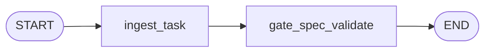

# Diseño técnico — agent-factory-langgraph

## Ubicación del código

- **Orquestador:** `packages/sdd-agent-orchestrator/`
- **Herramientas existentes:** raíz repo (`scripts/*`, `bin/framework-sdd.mjs`, `openspec/tools-manifest.yaml`)

## Flujo demo (v0.1)

- `ingest_task`: registra `taskInput` (análogo al string de `/gd:start`).
- `gate_spec_validate`: `node scripts/validate-spec.mjs` con cwd proyecto (`FRAMEWORK_SDD_PROJECT_ROOT` o raíz framework).

## Extensiones planificadas

1. **Loader manifiesto YAML** → definición dinámica de nodos o tools LangChain.
2. **Subgrafo por fase GAF** con transiciones condicionadas por `complexity_level` en estado.
3. **`interrupt`** tras nodos de alto riesgo (`write_db`, cambios masivos).
4. **Multi-agente:** grafo supervisor + subgrafos “Phantom Coder” / “Reaper Sec” como nodos especializados (roles de AGENTS.md).

## Dependencias

- `@langchain/langgraph`, `@langchain/core` (ver `packages/sdd-agent-orchestrator/package.json`).
